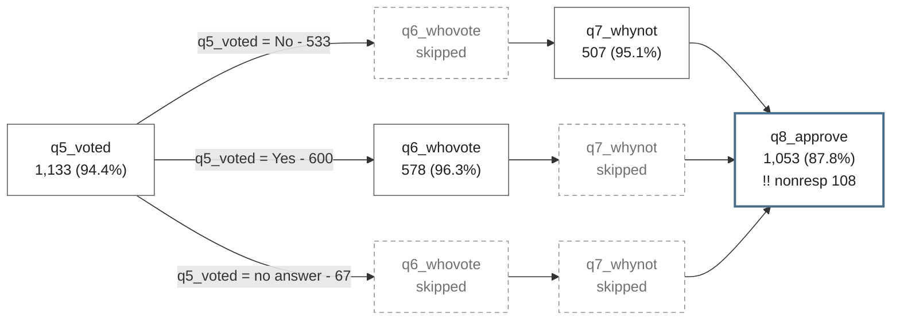

# surveymap

**Map how respondents moved through a survey.** A Stata command that reads a survey dataset and shows who was asked each question, who answered, who declined, and who the instrument routed around it, as a browser flow map and an Excel tracker.


*A twelve-item poll. The spine runs left to right in questionnaire order; where a question decides what comes next, it fans into lanes. Dashed grey boxes are questions that lane was never shown.*

## Why you'd reach for this

You have a survey with skip logic. Some questions were asked of everyone, some only of people who answered an earlier question a particular way, and some collected far fewer answers than you expected. `describe` and `misstable` tell you a column is 52% missing. They do not tell you whether that is 52% of people refusing to answer, or 52% of people never being shown the question at all. Those are opposite problems: one is a question-wording problem you can fix, the other is the instrument working correctly.

`surveymap` separates them, for every item, and draws the path through the questionnaire that the answers imply.

```stata
surveymap
surveymap draw
```

The first command reads the data in memory and prints a receipt; the second opens the map in your browser.

## Install

`surveymap` is self-contained: the commands and the help file, with no external Stata dependencies, no Python, and nothing to download at run time.

```stata
net install surveymap, from("https://raw.githubusercontent.com/ericabooth/surveymap-stata-public/main/") replace force
discard
which surveymap
help surveymap
```

The package ships `surveymap.pkg` and `stata.toc`, so Stata's installer picks up every file in one call; no manual `adopath` step is needed.

Requires Stata 16 or later (the frames era). The map it writes is a self-contained HTML page that opens with no internet connection and runs no JavaScript.

## Start here

```stata
surveymap demo
```

Writes a 600-person survey with a consent question, a party question, and a voting question that routes non-voters around the reason-for-not-voting item; scans it; prints the receipt; and tells you what to run next.

## The receipt

Every scan prints one line per item, in questionnaire order:

```
   #  item         answered      declined    not shown   routed around by
   7  q5_voted        1,133 (94.4%)      28      39  q1_consent==0
   8  q6_whovote        578 (48.2%)      22     600  q5_voted==0
   9  q7_whynot         507 (42.2%)      26     667  q5_voted==1
  15  q13_income        941 (78.4%)     220      39  q1_consent==0
```

`q6_whovote` and `q13_income` both look badly answered, for opposite reasons. `q6_whovote` was never shown to 600 people, because it asks who you voted for and they had just said they did not vote. `q13_income` was shown to nearly everyone, and 220 of them refused. The two sit one column apart in the table and call for completely different responses.

Three kinds of blank are counted separately throughout:

| | meaning |
|---|---|
| **answered** | a real answer |
| **declined** | extended missing (`.a` to `.z`: don't know, refused), or a code you name in `nonresponse()` |
| **not shown** | system missing (`.`), which is where skip logic lands |

## Pointing it at a real survey file

A delivered survey file is wider than the questionnaire: record ids, sample-frame columns from a voter or panel list, interviewer admin, vendor recodes, verbatim text. Mapping all of it gives you a picture with more columns than structure, and the columns that were never questions can look like branching to the routing detector.

```stata
surveymap [pweight=wtfinal], exclude(respid interviewer) nostrings
```

**Three kinds of blank, and only one is skip logic.** An item is blank because the respondent was routed past it, or because a sample-frame column does not apply to them (in one real file every voter-file column was blank for all the panel respondents, who are never matched to the voter file), or because a split ballot asked them the other version. The first is what the map is for; the other two should be excluded. The detector reports what the data shows, so read a detected gate as a claim to check.

## Weights

`pweight`s are allowed, and both counts are kept because they answer different questions. The unweighted count describes the people interviewed, which is the honest denominator for who was asked what. The weighted count describes the estimate. The journal gains `w_asked`, `w_answered` and `pct_answered_w`; the receipt gains a `wtd%` column.

```
   #  item         answered      declined    not shown   wtd%   routed around by
   4  Q8                  294 (26.8%)       0     805     28.4  Q7==0
```

A respondent whose weight is zero leaves the scope, exactly as they leave a weighted estimate, so the respondent count becomes the positive-weight base. The weight itself is never mapped as an item.

The map follows the same convention: **unweighted counts, weighted percentages**, with the caption saying so. A weighted map cannot be mistaken for an unweighted one, and an unweighted map never claims otherwise.

## Checking the map against the questionnaire

Survey projects usually keep their own table of the skip logic. That table and this map are two independent accounts of the same thing:

```stata
surveymap, verify(skiplogic.csv)
```

The file needs a header naming at least `varname` and `expected_n`. Each declared item is compared against what the answers show, and `r(N_mismatch)` comes back with the count that disagreed.

The two failures mean different things. An item the map routes but the table does not mention is usually an undocumented filter, or a small-cell correlation. **A declared gate the data does not show is the one to chase**, because the questionnaire and the file disagree about who was asked.

It works in reverse too: on a new delivery, scan first and use the `gated_by` output as the draft skip-logic table, then check that draft against the questionnaire.

## Branching

Name the questions whose answers you want the flow split by, and each category becomes a lane:

```stata
surveymap, branch(party)                    // every category is a lane
surveymap, branch(party = 1 2 3)            // these; everything else pools into "other"
surveymap, branch(party = 1/3 5)            // numlists expand
surveymap, branch(party = 1 3, voted = 1)   // two gates, comma separated
surveymap, branch(party, voted)             // two gates, every category of each
```

Lanes always partition the sample: the categories you kept, one **other** lane for the rest, one **no answer** lane for people who left the gate blank. Their counts sum to the number of respondents in scope, so nobody is lost and nobody is double counted. The battery asserts this on every gate.

The lanes open where the gate's questions are, not necessarily in the next column. A party question asked early can decide primary-turnout questions much later, and the lanes belong where those questions sit; the map heads each block with **split by party** so you always know which question opened it.

With no `branch()`, the two questions that route the most respondents are drawn, and the receipt names them so you can override with a gate you actually care about.


*Split by party. Democrats answer the Democratic primary question and are routed around the Republican one; Republicans the reverse; Independents answer both. The two smallest categories pool into **other**, and people who would not give a party form their own lane. The five lanes sum to the sample, and they rejoin the spine at the dot.*

## It renders on GitHub, too

`export(mermaid)` writes text that GitHub, Quarto and VS Code draw themselves, so a flow map can live in a README or a report with no image file to keep in sync. This block is the command's own output, pasted:



## How routing is found

There is no questionnaire spec in a `.dta` file, so `surveymap` reads routing out of the answers. A category is recorded as routing people around a later item when almost nobody in that lane answered it while the other lanes did: at most 2% inside, at least 50% outside. `detect(# #)` moves both thresholds.

This is evidence, not a specification. An item that everyone in a category happened not to answer looks exactly like an item they were never shown, and the receipt says so once. Read a detected gate as a claim worth checking, and name the gates yourself when you know the instrument.

## Pruning noisy branches

A gate with a long tail of small categories draws a map nobody can read. Three rules fold the small ones into one **other** lane: `prune(5)` for a share of the sample, `minn(30)` for a headcount, `maxcats(6)` for how many lanes to keep.

The journal keeps every category whatever the rules say, and the folding happens when the map is built. So you can re-cut a drawing without reading the data again:

```stata
surveymap, branch(party)
surveymap draw, prune(10)
surveymap draw, noprune
```

## Drawing the map

```stata
surveymap draw                                        // HTML, opens in your browser
surveymap draw, saving(flow_frag.html) embed replace  // a fragment for a report page
surveymap draw, export(mermaid) saving(flow) replace  // text GitHub renders itself
```

Items run left to right on a spine, each box carrying the name, the label, and the count and percent who answered, with `!!` on items a lot of people declined. Where a gate splits the sample the spine fans into lanes; a dashed grey box is an item that lane was routed around. The lanes rejoin at a dot and the spine continues. Hover any box for its full record.

The page has no height cap and scrolls sideways, because a survey is wider than it is tall. The `embed` fragment is scoped so it cannot restyle the page you drop it into.

## The Excel tracker

```stata
surveymap export, saving(flow.xlsx) replace
```

Three sheets: **sm_items** (one row per item: asked, answered, declined, not shown, and what routed it), **sm_branches** (one row per gate category), and **sm_flow** (one row per lane and item, with the rate and whether it was skipped). Counts arrive as numbers, so Excel sorts and filters them as numbers.

The map can hide the small lanes while the workbook keeps all of them: pass `noprune` to the export and the tracker is complete whatever the drawing shows. `format(dta)` and `format(csv)` write the journal as data to merge with anything else you track.

## Works with datadictionary

[`datadictionary`](https://github.com/ericabooth/datadictionary-stata-public) documents what a survey's variables *are*: types, labels, value labels, summary statistics, and how labels changed across waves. `surveymap` documents how respondents *moved* through them. They join on the variable name, and neither requires the other to be installed.

Flow columns into the codebook:

```stata
surveymap, branch(party) out(flow.tsv) replace
datadictionary, excel(codebook.xlsx) flow(flow.tsv) replace
```

adds `pct_answered_sm` and `skipped_by_sm` to the Variables sheet. Or flow sheets into the codebook workbook:

```stata
datadictionary, excel(codebook.xlsx) replace
surveymap export, dictionary(codebook.xlsx)
```

leaves every sheet `datadictionary` wrote untouched and adds the three `sm_` sheets beside them. One workbook then holds the item definitions, the response distributions, the label history, and the flow.

## Commands

| command | what it does |
|---|---|
| `surveymap` *[varlist]* *[weight]* | **scan**: read the data, write the journal, print the receipt |
| `surveymap demo` | write a small survey, scan it, show the output |
| `surveymap draw` | the flow map: HTML or mermaid |
| `surveymap export` | the tracker: `.xlsx`, `.dta`, or `.csv` |
| `surveymap receipt` *journal* | reprint a receipt from a saved journal |
| `surveymap clear` | forget the remembered journal; no file is touched |

A varlist chooses which items to map; the columns keep their dataset order either way. `if` and `in` restrict who is in scope, and every count is computed within it. The data in memory are never modified.

## Related work

`surveymap` draws boxes and lanes because a survey node has to show more than a width: the item, its label, how many were asked, how many answered, how many declined. These draw flows in other shapes and are the better tool when that is the shape you want.

- [`sankey`](https://github.com/asjadnaqvi/stata-sankey) and `alluvial` (Naqvi): ribbons whose width is the count, from `from`/`to`/`value` data. Excellent for two or three transitions; a survey has too many columns and too much per node for a ribbon to show.
- [`flowchart`](https://ideas.repec.org/c/boc/bocode/s458387.html) (Dodd): CONSORT and PRISMA subject-disposition figures as LaTeX PGF/TikZ. Needs LaTeX, and you supply the counts.
- [`direct_flow`](https://rlpacheco.github.io/direct_flow) (Pacheco, Martimbianco and Riera): systematic-review study-selection flowcharts, again from counts you supply.
- `statflow`: an Excel sheet of logic, variable, statistic and value, with the value column rewritten from the data. You fix the shape; it fills the numbers.
- [`datadictionary`](https://github.com/ericabooth/datadictionary-stata-public) (Booth): the codebook side, and a two-way bridge as described above.
- [`mergemap`](https://github.com/ericabooth/mergemap-stata-public) (Booth): how the datasets were assembled, where `surveymap` covers movement through one dataset's columns.
- In official Stata, `misstable` summarises missingness patterns and `tabulate, missing` shows one crosstab. Neither separates a refusal from a skip, and neither follows the flow across the instrument.

## Repository layout

| path | contents |
|---|---|
| `src/` | the package: `surveymap.ado`, the `_sm_*` helpers, and the help file |
| `tests/` | the regression battery and the fake-survey fixture |
| `proto/` | the journal schema and the contract fixtures every reader is tested against |
| `images/` | the screenshot in this README |

## Testing

```stata
cd tests
do surveymap_pkgtest.do
```

132 checks across 17 blocks, run on Stata 16.1 and on the current release, covering the fixture's routing truths, the branch parser, lane partitioning, pruning at scan and at draw time, weights, `exclude()`/`nostrings`, `verify()`, the HTML and mermaid renderers, the Excel tracker, and both directions of the `datadictionary` bridge.

## Author and license

Eric A. Booth. MIT licensed; see [LICENSE](LICENSE).

Issues and suggestions: [github.com/ericabooth/surveymap-stata-public/issues](https://github.com/ericabooth/surveymap-stata-public/issues)
