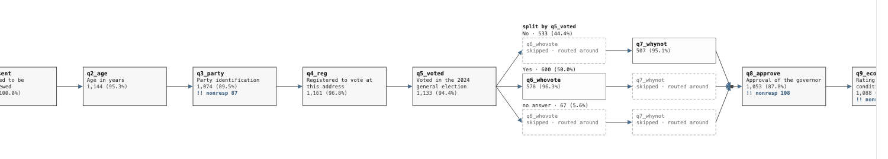
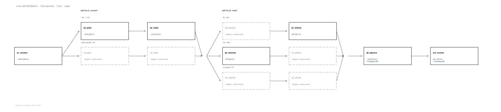
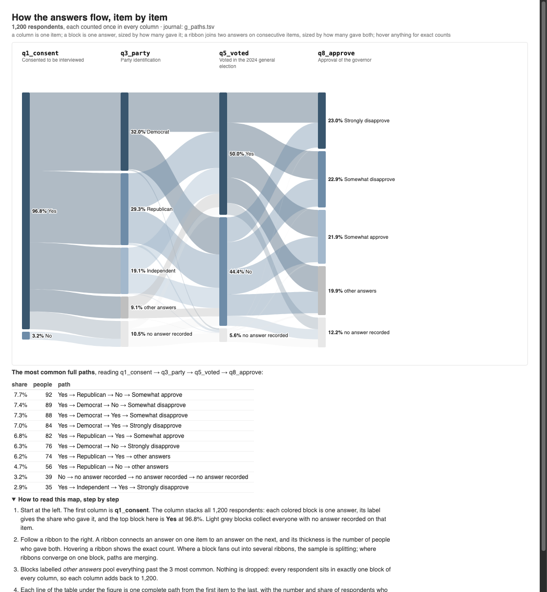
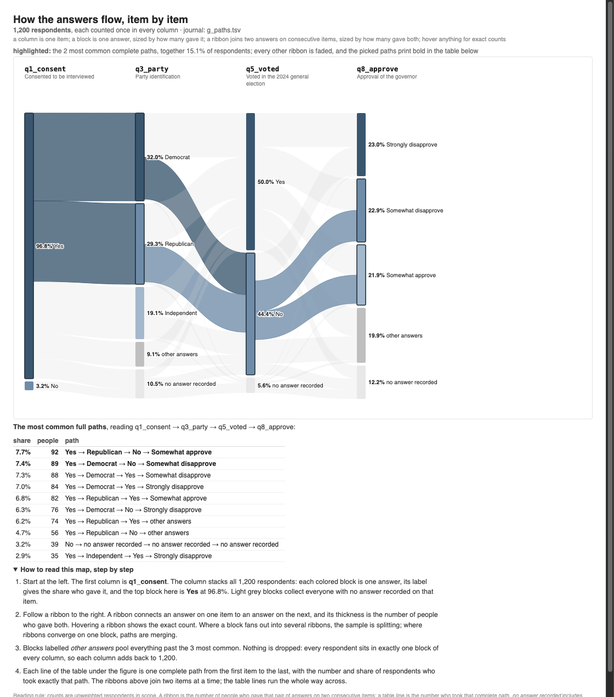
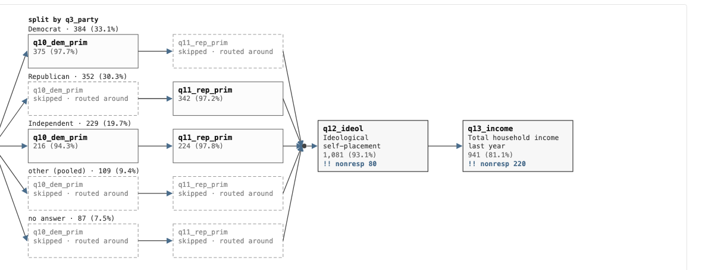
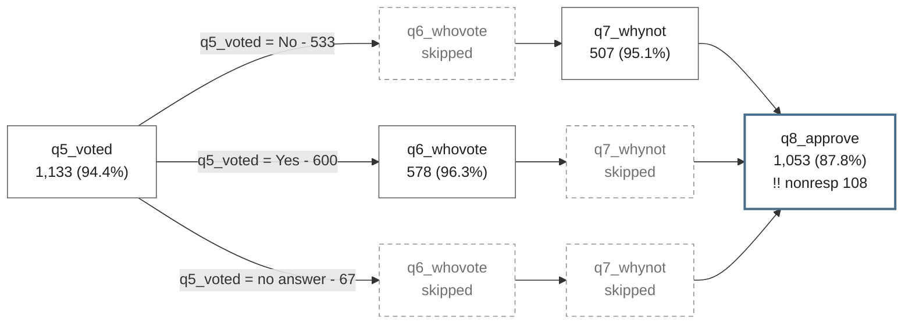
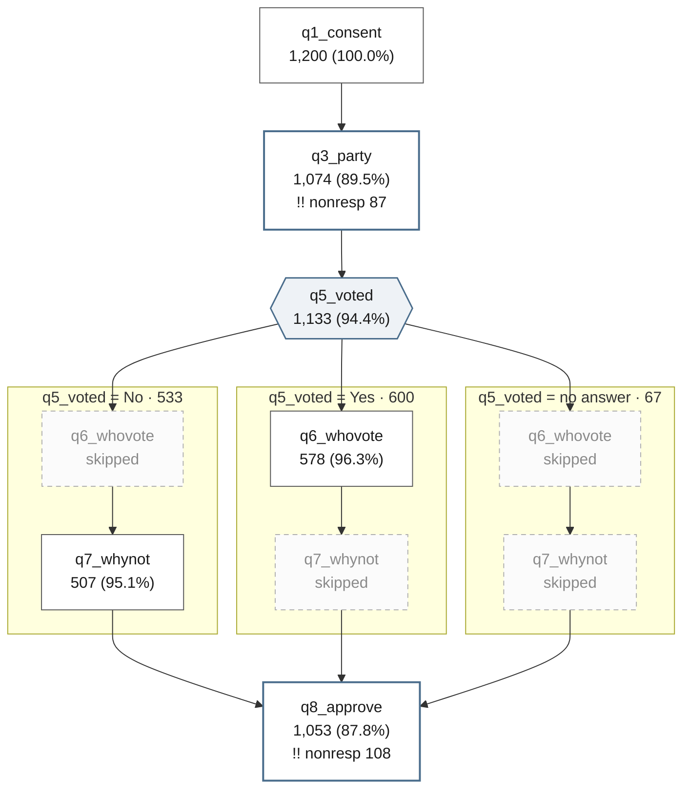
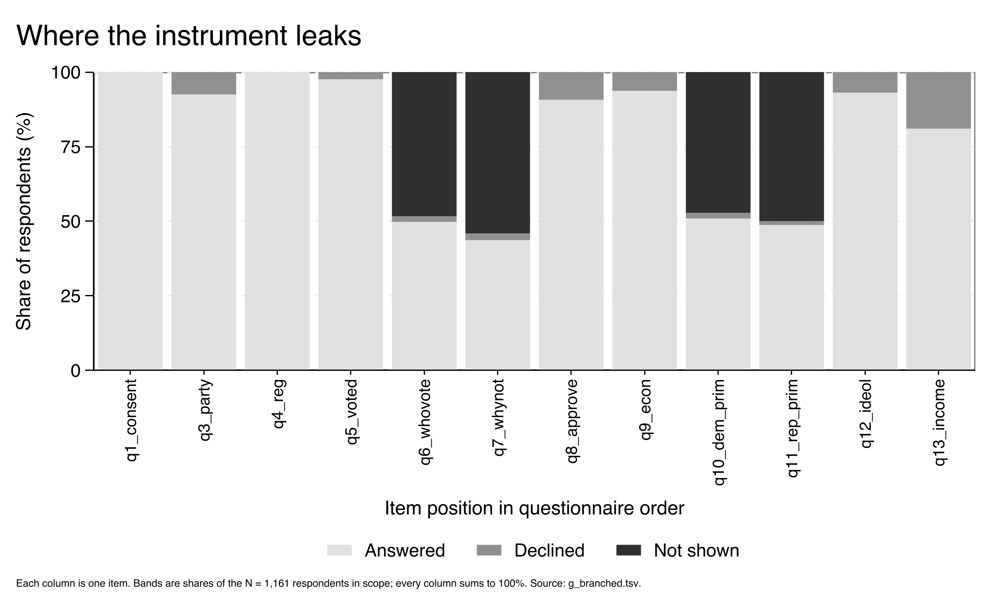

# surveymap

**Map how respondents moved through a survey.** A Stata command that reads a survey dataset and shows who was asked each question, who answered, who declined, and who the instrument routed around it, as a browser flow map and an Excel tracker.



*A twelve-item poll. The spine runs left to right in questionnaire order; where a question decides what comes next, it fans into lanes. Dashed grey boxes are questions that lane was never shown.*

## Why you'd reach for this

Consider a scenario: You have a survey with skip logic. Some questions were asked of everyone, some only of people who answered an earlier question a particular way, and some collected far fewer answers than you expected. `describe` and `misstable` tell you a column is 52% missing. They do not tell you whether that is 52% of people refusing to answer, or 52% of people never being shown the question at all. Those are opposite problems: one is a question-wording problem you can fix, the other is the instrument working correctly.




`surveymap` separates them, for every item, and draws the path through the questionnaire that the answers imply.

```stata
surveymap
surveymap draw
```

The first command reads the data in memory and prints a receipt; the second opens the map in your browser.

## Install

`surveymap` is self-contained: the commands and the help file, with no external Stata dependencies, no Python, and nothing to download at run time.

```stata
net install surveymap, from("https://raw.githubusercontent.com/ericabooth/surveymap-stata-public/main/") replace force
discard
which surveymap
help surveymap
```

The package ships `surveymap.pkg` and `stata.toc`, so Stata's installer picks up every file in one call; no manual `adopath` step is needed.

Requires Stata 16 or later (the frames era). The map it writes is a self-contained HTML page that opens with no internet connection and runs no JavaScript.

## Start here

```stata
surveymap demo
```

Writes a 600-person survey with a consent question, a party question, and a voting question that routes non-voters around the reason-for-not-voting item; scans it; prints the receipt; and tells you what to run next.

## The receipt

Every scan prints one line per item, in questionnaire order:

```
   #  item         answered      declined    not shown   routed around by
   7  q5_voted        1,133 (94.4%)      28      39  q1_consent==0
   8  q6_whovote        578 (48.2%)      22     600  q5_voted==0
   9  q7_whynot         507 (42.2%)      26     667  q5_voted==1
  15  q13_income        941 (78.4%)     220      39  q1_consent==0
```

`q6_whovote` and `q13_income` both look badly answered, for opposite reasons. `q6_whovote` was never shown to 600 people, because it asks who you voted for and they had just said they did not vote. `q13_income` was shown to nearly everyone, and 220 of them refused. The two appear one column apart in the table and call for completely different responses.

Three kinds of blank are counted separately throughout:

| | meaning |
|---|---|
| **answered** | a real answer |
| **declined** | extended missing (`.a` to `.z`: don't know, refused), or a code you name in `nonresponse()` |
| **not shown** | system missing (`.`), which is where skip logic lands |

**The arithmetic is checked, not assumed.** Every respondent in scope lands in exactly one of answered, declined or not shown at every item, so those three counts have to add to the sample on every row. The scan checks it and the receipt reports it, because a map whose arithmetic is wrong looks exactly like one whose arithmetic is right. `r(N_unbalanced)` is the number of items that failed, and the journal records the verdict so a reader coming to the file later can see the check was run.

## Where to start a map

A survey with little skip logic draws as a single line of boxes, which answers who was asked what and nothing else. The starting points below turn that line into paths a reader can follow, and they combine freely.

**The response braid.** `surveymap paths` follows the answers instead of the routing: every item becomes a column, each of its `top(k)` most common answers a block, and a ribbon between two blocks carries the respondents who gave both answers on consecutive items. The remainder pools into *other answers*, and *no answer recorded* holds everyone with nothing on the item. Every respondent in scope sits in exactly one block of every column, so each column adds back to the sample; the battery asserts it. Under the figure, the ten most common complete paths, end to end.



*The gallery's fake 1,200-person poll as a braid: consent, party, turnout, approval. The grey blocks are pooled and missing answers; the table under the figure names the most common complete paths.*

The example below runs as typed on data Stata ships:

```stata
sysuse nlsw88, clear
surveymap paths married collgrad union, top(2) out(flows.tsv) saving(flows.html)
```

**Pick out the key paths.** `highlight()` keeps the flows you want a reader to see first and fades every other ribbon. `highlight(paths 3)` keeps the three most common complete paths, prints them bold in the table, and states their combined share in the caption; `highlight(union = 1)` keeps the ribbons into and out of one answer block (`other` and `noanswer` name the grey blocks). It also works on `surveymap draw` over a paths journal, so the same journal redraws with different highlights, no rescan.

```stata
surveymap paths married collgrad union, top(2) highlight(paths 2) saving(flows.html) replace
surveymap draw flows.tsv, highlight(union = 1) saving(flows2.html) replace
```



*The same braid with `highlight(paths 2)`: the two most common complete routes keep full colour and print bold in the table; everything else fades.*

**The spine with its splits.** `responses(3)` adds each item's three most common answers to its box on the routing map, drawn as share bars, with the rest pooled into *other answers* and the declined share on its own row. The denominator is the people the item was put to (answered plus declined), so the rows inside a box account for everyone who saw the question. Items with more than 30 distinct values are skipped with a note advising `branch(age = cut(...))` instead.

```stata
surveymap, responses(3)
```

**One subgroup's path.** An `if` restriction traces the respondents it selects through the questionnaire, on the paths view or the scan, and the page says so: the map opens with `scope: only respondents where ...`.

```stata
surveymap paths q1 q2 q3 if inlist(party, 2, 3) & age > 40
```

**The outlier paths.** `profile()` splits the routing map by what respondents did rather than what they answered; see the section below.

```stata
surveymap, profile(declined)
```

Every HTML page carries **How to read this map, step by step**, generated with the survey's own item and gate names, plus the full record as a table.

## Pointing it at a real survey file

A delivered survey file is wider than the questionnaire: record ids, sample-frame columns from a voter or panel list, interviewer admin, vendor recodes, verbatim text. Mapping all of it gives you a picture with more columns than structure, and the columns that were never questions can look like branching to the routing detector.

```stata
surveymap [pweight=wtfinal], exclude(respid interviewer) nostrings
```

**A blank is not always skip logic.** An item is blank because the respondent was routed past it, or because a sample-frame column does not apply to them (in one real file every voter-file column was blank for all the panel respondents, who are never matched to the voter file), or because a split ballot asked them the other version. The first is what the map is for; the other two should be excluded. The detector reports what the data shows, so read a detected gate as a claim to check.

## Weights

`pweight`s are allowed, and both counts are kept because they answer different questions. The unweighted count describes the people interviewed, which is the honest denominator for who was asked what. The weighted count describes the estimate. The journal gains `w_asked`, `w_answered` and `pct_answered_w`; the receipt gains a `wtd%` column.

```
   #  item         answered      declined    not shown      wtd%    routed around by
   4  Q8              294        (26.8%)       0     805     28.4   Q7==0
```

A respondent whose weight is zero leaves the scope, exactly as they leave a weighted estimate, so the respondent count becomes the positive-weight base. The weight itself is never mapped as an item.

The map follows the same convention: **unweighted counts, weighted percentages**, with the caption saying so. A weighted map cannot be mistaken for an unweighted one, and an unweighted map never claims otherwise.

## Checking the map against the questionnaire

Survey projects usually keep their own table of the skip logic. That table and this map are two independent accounts of the same thing:

```stata
surveymap, verify(skiplogic.csv)
```

The file needs a header naming at least `varname` and `expected_n`. Each declared item is compared against what the answers show, and `r(N_mismatch)` comes back with the count that disagreed.

The two failures mean different things. An item the map routes but the table does not mention is usually an undocumented filter, or a small-cell correlation. **A declared gate the data does not show is the one to chase**, because the questionnaire and the file disagree about who was asked.

It works in reverse too: on a new delivery, scan first and use the `gated_by` output as the draft skip-logic table, then check that draft against the questionnaire.

**The disagreement is drawn, not just counted.** A number in a receipt is something somebody has to go looking for, so `verify()` appends its verdict to the journal as `note` rows and every renderer marks the item with `!?`, on the spine or inside a fan, with the declared and observed counts on hover. The journal schema is append-only and read by name, so those rows cannot disturb a reader that ignores them, and a journal written without `verify()` draws exactly as before. `!?` means the questionnaire and the file disagree; `!!` still means a lot of people declined. Two different problems, two different marks.

## Branching

Name the questions whose answers you want the flow split by, and each category becomes a lane:

```stata
surveymap, branch(party)                    // every category is a lane
surveymap, branch(party = 1 2 3)            // these; everything else pools into "other"
surveymap, branch(party = 1/3 5)            // numlists expand
surveymap, branch(party = 1 3, voted = 1)   // two gates, comma separated
surveymap, branch(party, voted)             // two gates, every category of each
```

Lanes always partition the sample: the categories you kept, one **other** lane for the rest, one **no answer** lane for people who left the gate blank. Their counts sum to the number of respondents in scope, so nobody is lost and nobody is double counted. The battery asserts this on every gate.

The lanes open where the gate's questions are, not necessarily in the next column. A party question asked early can decide primary-turnout questions much later, and the lanes belong where those questions sit; the map heads each block with **split by party** so you always know which question opened it.

**Gating on a continuous item.** Age in years has too many values to be a lane, so you say where to cut it:

```stata
surveymap, branch(age = cut(25 35 45 65))   // bands at the breaks you name
surveymap, branch(hhinc = q(4))             // quartile bands
```

There is deliberately no default cut. A break chosen by software becomes a stated fact in a figure somebody else reuses, and where to divide age is a decision about the population you are describing, so you make it and the journal records what you chose. Nobody falls outside the bands: everyone below the first break belongs to the first lane and everyone at or above the last belongs to the top one. That is where this differs from `egen cut, at()`, which leaves both tails missing; lanes that dropped the tails would no longer add up to the sample.

With no `branch()`, the two questions that route the most respondents are drawn, and the receipt names them so you can override with a gate you actually care about.



*Split by party. Democrats answer the Democratic primary question and are routed around the Republican one; Republicans the reverse; Independents answer both. The two smallest categories pool into **other**, and people who would not give a party form their own lane. The five lanes sum to the sample, and they rejoin the spine at the dot.*

## Splitting by what the respondent did

`branch()` splits the map by an answer, so the lanes say what Republicans did and what Democrats did. `profile()` splits it by something the respondent did while answering, so the lanes say what the people who left items blank did. Reach for it when your question is whether nonresponse sits with one kind of respondent rather than spread evenly, and you want to see *where* along the instrument it happened.

```stata
surveymap, profile(declined)                  // % of asked items left unanswered
surveymap, profile(declined = cut(10 25))     // breaks read as percentages
surveymap, profile(refused), refusedcode(.b)  // the survey's own refusal code
surveymap, profile(breakoff)                  // where they stopped answering
surveymap, profile(asked = q(4))              // how far the routing carried them
```

**Why the first three are shares and not counts.** Skip logic asks different respondents different numbers of questions, so a Democrat and a Republican on a split-ballot instrument have different denominators. A count of declines is not comparable between them and a share is, which is why these divide by the items each respondent was actually asked. An item a skip routed around is in neither the numerator nor the denominator: counting it as a decline would make a well-behaved respondent on a long branch look like a bad one. NCES Statistical Standard 1-3-5 and the AAPOR *Standard Definitions* (10th ed., 2023) both define the item base this way.

**Where the default splits.** For a share the default cuts at zero and nowhere else, giving you **none** and **at least one**. Zero is the only boundary on this measure that is not a judgement call, and a threshold like "declined more than 20 percent" is a decision about what counts as a lot. AAPOR is explicit that such a boundary belongs to the researcher and has to be declared, so `surveymap` will not supply one. Set your own with `cut()` and the journal records that you did.

**What the map can and cannot claim.** A lane built this way is descriptive. It shows where answers were not obtained; whether that distorts an estimate depends on whether the people who declined differ on the thing being measured, and response data cannot establish that. Groves and Peytcheva's meta-analysis of 59 nonresponse bias studies found the nonresponse rate is by itself a poor predictor of nonresponse bias, and Groves (2006) put the variance in bias it explains at about 11%. A high rate is not, on its own, evidence of a biased estimate. The *amount* of declining inside a lane you defined by declining is also true by construction; the finding is *where* it happened. Every derived gate is drawn with its own shape and labelled `derived, not asked`, and the journal records the caveat.

**Two conditions this refuses to build.** `profile(exaggerator)` returns a refusal with the reason. People who over-report a socially desirable answer resemble people who report it honestly on everything a survey records: Ansolabehere and Hersh's fifty-state vote validation found over-reporters look like voters on demographics and attitudes alike. A flag built from the answers alone reproduces the profile of the behaviour rather than of the misreporting, and labels older, better-educated, more engaged respondents as liars. Measuring it takes an external record to validate against, or an instrument designed for it: a list experiment, randomised response, or planted foils.

`profile(straightlining)` is refused for a different reason. Non-differentiation is measurable, but only inside a battery you name, and only where answering the same way down it would be implausible. Where a straight line is a plausible set of answers, Schonlau and Toepoel found 15 to 40% of respondents produce one, against under 2% where it is implausible; the index cannot tell those two apart. Non-differentiation is also more common among respondents with less schooling (Krosnick and Alwin 1988), and attention-check failure correlates with substantive characteristics in the same way (Berinsky, Margolis and Sances 2014), so a lane built on it is partly a lane built on education. A survey file does not record which items share a response scale, so this package does not guess.

What it shows you instead is `profile(refused)` against `profile(dontknow)`. Shoemaker, Eichholz and Skewes found don't-know associated with the cognitive effort a question demands, and refusal associated with effort *and* with how sensitive the question is. Refusals stacking on an income block is evidence about sensitivity; don't-knows spread across an attitude battery is evidence about burden. Those point at different fixes, which is why the package keeps them apart instead of adding them together.

## It renders on GitHub, too

`export(mermaid)` writes text that GitHub, Quarto and VS Code draw themselves, so a flow map can live in a README or a report with no image file to keep in sync. This block is the command's own output, pasted:




`layout(vertical)` writes the same map turned on its side, with one `subgraph` swimlane per lane. A report page scrolls down, so this is usually the one you want in a document; the horizontal default suits a slide.



## How routing is found

There is no questionnaire spec in a `.dta` file, so `surveymap` reads routing out of the answers. A category is recorded as routing people around a later item when almost nobody in that lane answered it while the other lanes did: at most 2% inside, at least 50% outside. `detect(# #)` moves both thresholds.

This is evidence, not a specification. An item that everyone in a category happened not to answer looks exactly like an item they were never shown, and the receipt says so once. Read a detected gate as a claim worth checking, and name the gates yourself when you know the instrument.

## Pruning noisy branches

A gate with a long tail of small categories draws a map nobody can read. Three rules fold the small ones into one **other** lane: `prune(5)` for a share of the sample, `minn(30)` for a headcount, `maxcats(6)` for how many lanes to keep.

The journal keeps every category whatever the rules say, and the folding happens when the map is built. So you can re-cut a drawing without reading the data again:

```stata
surveymap, branch(party)
surveymap draw, prune(10)
surveymap draw, noprune
```

## Drawing the map

```stata
surveymap draw                                        // HTML, opens in your browser
surveymap draw, saving(flow_frag.html) embed replace  // a fragment for a report page
surveymap draw, export(mermaid) saving(flow) replace  // text GitHub renders itself
surveymap draw, export(png) saving(figures/flow)      // a figure for a paper
```

Items run left to right on a spine, each box carrying the name, the label, and the count and percent who answered, with `!!` on items a lot of people declined. Where a gate splits the sample the spine fans into lanes; a dashed grey box is an item that lane was routed around. The lanes rejoin at a dot and the spine continues. Hover any box for its full record.

**Which way it runs.** `layout(vertical)` turns the map on its side: items run down the page and a gate spreads its lanes across it, one column per lane.

```stata
surveymap draw, layout(vertical) saving(flow_tall.html) replace
surveymap draw, export(mermaid) layout(vertical) saving(flow_tall) replace
```

Use it when the map is going into a report or a README, because a page scrolls down and a long instrument is taller than any screen is wide. The horizontal default suits a slide and a wide monitor. In mermaid the vertical map draws each lane as a labelled `subgraph`, so the grouping is drawn rather than inferred from where the boxes sit. Both layouts read the same journal, so you can write one of each without rescanning.

**Where the lanes land.** A mermaid file declares the lanes lane 1 first, but which order they are *drawn* in belongs to whichever mermaid renders it, and renderers disagree: mermaid-cli and GitHub lay the same file out in opposite orders. Every lane is therefore labelled with the answer that opened it, and nothing depends on where it sits. When the order has to be guaranteed, as it does for a banded gate whose lanes run low to high, use the HTML map or the `export(png)` figure, which are laid out here rather than by a third party.

**The same numbers, as text.** Under the figure the page carries a `<details>` block holding the whole map as a table: one row per item, with answered, declined, not shown, and what routed it. A diagram is not readable by everyone, and the honest fallback for a figure built from a table is that table rather than a sentence describing it. The figure is marked `role="img"`, points at its own title and description, and is taken out of the keyboard tab order so a forty-node map does not become forty tab stops.

The page has no height cap and scrolls sideways, because a survey is wider than it is tall. The `embed` fragment is scoped so it cannot restyle the page you drop it into, and the package ships the check that proves it (`tests/embedcheck/check_embed_scoping.py`), which refuses a fragment carrying an unscoped selector, a script, or a page wrapper.

`export(png)` and `export(svg)` draw the same figure through Stata's own graph engine, for a paper or a slide; asking for either writes both.


A figure is readable up to a point. Past `maxnodes()` drawn columns (default 14) it stops and points you at the HTML page, which scrolls and keeps the full record on hover. A fan counts as one column however many items sit inside it, so the limit is on what the eye has to follow.

## The band chart, for a long instrument

The flow map has a node budget. Past `maxnodes()` drawn columns it stops and points you at the HTML page, and on a 230-item instrument there is no arrangement of boxes and lanes that fits a page at all. `surveymap band` has no budget: one thin column per item, in questionnaire order, each split into answered, declined and not shown, stacking to the whole sample.

```stata
surveymap band
surveymap band journal.tsv, saving(leaks.png) replace
```



*Every column is one item. `q6_whovote` and `q7_whynot` are half **not shown**, which is the vote filter doing its job. `q13_income` was shown to nearly everyone and has the widest **declined** band, which is 220 people refusing. The two look nothing alike here, and in a "percent missing" table they would look the same.*

It answers a different question from the map, which is why both exist. The map tells you who was asked what; the band chart tells you where along the instrument the answers stop coming, on one page, for a questionnaire of any length. Like `draw`, it reads the journal the last scan wrote when you don't name one. The shape is TraMineR's state-distribution plot drawn with `twoway`: one bar per item on a short survey, switching to a filled area once there are more items than bars can show.

**Every column is drawn from the three counts, never from a hard-coded 100.** A journal whose counts don't add to the sample draws a short column rather than a full one that quietly lies, and `r(devmax)` reports the largest shortfall. On a journal this package wrote it is always zero, because the scan checks the same arithmetic.

## The Excel tracker

```stata
surveymap export, saving(flow.xlsx) replace
```

Three sheets: **sm_items** (one row per item: asked, answered, declined, not shown, and what routed it), **sm_branches** (one row per gate category), and **sm_flow** (one row per lane and item, with the rate and whether it was skipped). Counts arrive as numbers, so Excel sorts and filters them as numbers.

The map can hide the small lanes while the workbook keeps all of them: pass `noprune` to the export and the tracker is complete whatever the drawing shows. `format(dta)` and `format(csv)` write the journal as data to merge with anything else you track.

## Works with datadictionary

[`datadictionary`](https://github.com/ericabooth/datadictionary-stata-public) documents what a survey's variables *are*: types, labels, value labels, summary statistics, and how labels changed across waves. `surveymap` documents how respondents *moved* through them. They join on the variable name, and neither requires the other to be installed.

Flow columns into the codebook:

```stata
surveymap, branch(party) out(flow.tsv) replace
datadictionary, excel(codebook.xlsx) flow(flow.tsv) replace
```

adds `pct_answered_sm` and `skipped_by_sm` to the Variables sheet. Or flow sheets into the codebook workbook:

```stata
datadictionary, excel(codebook.xlsx) replace
surveymap export, dictionary(codebook.xlsx)
```

leaves every sheet `datadictionary` wrote untouched and adds the three `sm_` sheets beside them. One workbook then holds the item definitions, the response distributions, the label history, and the flow.

## Commands

| command | what it does |
|---|---|
| `surveymap` *[varlist]* *[weight]* | **scan**: read the data, write the journal, print the receipt |
| `surveymap demo` | write a small survey, scan it, show the output |
| `surveymap draw` | the flow map: HTML or mermaid |
| `surveymap export` | the tracker: `.xlsx`, `.dta`, or `.csv` |
| `surveymap receipt` *journal* | reprint a receipt from a saved journal |
| `surveymap clear` | forget the remembered journal; no file is touched |

A varlist chooses which items to map; the columns keep their dataset order either way. `if` and `in` restrict who is in scope, and every count is computed within it. The data in memory are never modified.

## Related work

`surveymap` draws boxes and lanes because a survey node has to show more than a width: the item, its label, how many were asked, how many answered, how many declined. These draw flows in other shapes and are the better tool when that is the shape you want.

- [`sankey`](https://github.com/asjadnaqvi/stata-sankey) and `alluvial` (Naqvi): ribbons whose width is the count, from `from`/`to`/`value` data, as mermaid's own [`sankey-beta`](https://mermaid.js.org/syntax/sankey.html) does from three CSV columns. Reach for one of them when two or three transitions are the whole story. `surveymap` does not encode counts as widths, for two reasons worth knowing before you go looking for the option. A ribbon diagram invites the reader to expect the widths at a node to add up, and on a questionnaire they do not: the people who declined an item are a gap the eye reads as attrition already explained. And on a 15 to 40 item instrument the smallest flows fall below a pixel, so a path taken by nobody disappears, which on a QC map is usually the finding you most wanted.
- [`flowchart`](https://ideas.repec.org/c/boc/bocode/s458387.html) (Dodd): CONSORT and PRISMA subject-disposition figures as LaTeX PGF/TikZ. Needs LaTeX, and you supply the counts.
- [`direct_flow`](https://rlpacheco.github.io/direct_flow) (Pacheco, Martimbianco and Riera): systematic-review study-selection flowcharts, again from counts you supply.
- `statflow`: an Excel sheet of logic, variable, statistic and value, with the value column rewritten from the data. You fix the shape; it fills the numbers.
- [`datadictionary`](https://github.com/ericabooth/datadictionary-stata-public) (Booth): the codebook side, and a two-way bridge as described above.
- [`mergemap`](https://github.com/ericabooth/mergemap-stata-public) (Booth): how the datasets were assembled, where `surveymap` covers movement through one dataset's columns.
- In official Stata, `misstable` summarises missingness patterns and `tabulate, missing` shows one crosstab. Neither separates a refusal from a skip, and neither follows the flow across the instrument.

## Repository layout

| path | contents |
|---|---|
| `src/` | the package: `surveymap.ado`, the `_sm_*` helpers, and the help file |
| `tests/` | the regression battery, the fake-survey fixture, and the fragment-scoping check |
| `gallery/` | every example output, regenerated from scratch by `gallery/runall.do` |
| `proto/` | the journal schema and the contract fixtures every reader is tested against |
| `images/` | the screenshot in this README |

## Testing

```stata
cd tests
do surveymap_pkgtest.do
```

373 checks across 26 blocks, run on Stata 16.1 and on the current release, covering the fixture's routing truths, the branch parser, banding a continuous gate, the derived conditions and the ones the package refuses to build, the conservation arithmetic, the drawn verify disagreement, the band chart at 230 items, the response rows and their exact partition of the answered count, the response braid's conservation (columns, ribbons and complete paths all partition the scope), the scope round-trip to the page, lane partitioning, pruning at scan and at draw time, weights, `exclude()`/`nostrings`, `verify()`, both layouts of all four renderers, the Excel tracker, the fragment's scoping guarantee, and both directions of the `datadictionary` bridge.

The gallery is a second, coarser test: it rebuilds every example artifact from one fake survey and counts its own failures, because a Stata do-file can abort and still leave the runner reporting success.

```stata
cd gallery
do runall.do
```

Two checks run outside Stata, because a broken picture is not a Stata error. A layout bug writes coordinates the browser draws without complaint, so `check_map_geometry.py` reads the coordinates back out and refuses a map with a box off the canvas, two boxes on top of each other, or a lane heading with nothing under it. `check_embed_scoping.py` refuses a fragment carrying an unscoped selector, a script, or a page wrapper.

```bash
python3 tests/svgcheck/check_map_geometry.py gallery/*.html
```

## Author and license

Eric A. Booth. MIT licensed; see [LICENSE](LICENSE).
Sr Researcher, Texas 2036.org
Issues and suggestions: [github.com/ericabooth/surveymap-stata-public/issues](https://github.com/ericabooth/surveymap-stata-public/issues)
