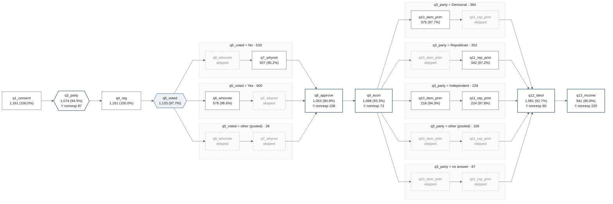

# surveymap: g_branched.tsv - mermaid flow, LR

Items run left to right in questionnaire order; a gate fans the sample into lanes that rejoin the spine at the end of its segment. A dashed node is a cell the lane was routed around. `!!` marks a warning.

*surveymap _sm_rendertext 0.1.0 - journal g_branched.tsv - rendered 27 Aug 2026 17:09:30 - Stata 19.5 MP*

